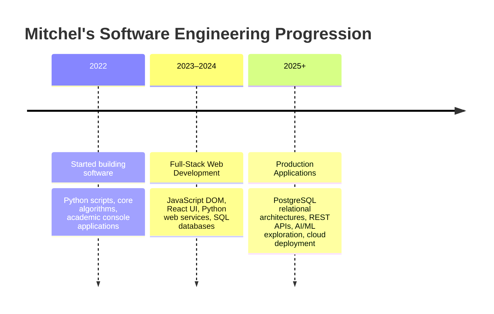

<!--
  NOTE ON STYLING (read before editing):
  GitHub's markdown renderer strips the `style` attribute from every HTML
  tag (img, div, etc.) for security reasons — it is not on their
  sanitization allow-list. That means border-radius, border, and
  box-shadow declarations NEVER render on github.com, no matter how they're
  written. Only these img/div attributes survive: width, height, align.

  This file uses only those supported attributes, so it renders identically
  and correctly wherever it's viewed (github.com, GitHub mobile, most
  markdown viewers) instead of depending on styling that silently vanishes.

  The profile photo below is "mitchel.jpeg" — a circular crop with the
  neon-green ring/glow baked directly into the image's pixels (flattened
  onto a solid dark background matching the badge colors used elsewhere in
  this file). That's the only way to get a ring effect on GitHub, since CSS
  border-radius/box-shadow never render there.
-->

<div align="center">

  <!-- Profile Image (circular crop + neon ring baked into the JPEG itself) -->
  <a href="https://github.com/mitchndinda-code">
    
  </a>

  <br/><br/>

  <!-- Heading -->
  <h1>⚡ Mitchel Ndinda Martin</h1>

  <!-- Dynamic Typing Animation SVG -->
  <a href="https://github.com/mitchndinda-code">
    
  </a>

  <br/><br/>

  <!-- Quick Badges Strip -->
  <p align="center">
    <a href="https://github.com/mitchndinda-code">
      
    </a>
    <a href="https://www.jkuat.ac.ke/">
      
    </a>
    <a href="mailto:mitchndinda@gmail.com">
      
    </a>
  </p>

  <!-- Social & Direct Contact Links -->
  <p align="center">
    <a href="mailto:mitchndinda@gmail.com">
      
    </a>
    <a href="https://www.linkedin.com/in/mitchel-martin-42503a438">
      
    </a>
    <a href="https://github.com/mitchndinda-code">
      
    </a>
    <a href="https://wa.me/254785091595">
      
    </a>
    <a href="tel:+254785091595">
      
    </a>
  </p>

</div>

---

<div align="center">
  
</div>

## 👨‍💻 Executive Summary

> *"I write software covering the complete lifecycle of modern web systems — from intuitive user experience design and accessible frontends to relational PostgreSQL modeling, high-throughput REST APIs, and automated deployments. I build systems that are intuitive to use today and effortless to maintain six months later."*

```yaml
Developer Profile:
  Full Name: "Mitchel Ndinda Martin"
  Role: "Full-Stack Web Developer & Software Engineer"
  Degree: "BSc. Computer Science (JKUAT, Expected 2027)"
  Current Base: "Nairobi, Kenya (UTC+3, Remote-Ready)"
  Experience: "4+ years of self-directed & academic software engineering"
  Core Competencies:
    - "Full-Stack Web Architecture"
    - "Relational Schema Normalization & PostgreSQL"
    - "RESTful API Engineering & Secure Auth"
    - "High-Performance Interactive React Frontends"
    - "Continuous Integration & Production Deployment"
```

---

## 🛠️ Technical Arsenal & Skills Matrix

<div align="center">
  <!-- Dynamic Animated Skills Banner -->
  <a href="#-technical-arsenal--skills-matrix">
    
  </a>
</div>

<br/>

### 1. Programming Languages
| Language | Focus & Applied Ecosystem | Skill Level |
| :--- | :--- | :---: |
|  **Python** | Backend APIs, Flask, Django, automation, data manipulation | Advanced |
|  **JavaScript (ES6+)** | Modern asynchronous workflows, DOM manipulation, React, modular JS | Advanced |
|  **Java** | OOP architecture, data structures, enterprise foundations | Proficient |
|  **C++** | Algorithms, low-level memory management, systems computing | Proficient |
|  **C#** | Application development, strongly-typed architectures | Proficient |
|  **SQL** | Complex queries, joins, constraints, relational indexing | Advanced |

### 2. Frontend Engineering
| Technology | Capabilities & Implemented Patterns |
| :--- | :--- |
|  **React** | Component-driven UI, state management, hooks, routing, performance optimization |
|  **HTML5** | Semantic structure, accessibility (a11y), SEO optimization, modern standards |
|  **CSS3** | Responsive layouts, Flexbox/Grid, custom cyber themes, micro-animations |
|  **Bootstrap** | Rapid prototyping, responsive 12-column grid systems, utility design |

### 3. Backend, APIs & Architecture
| Technology | Capabilities & Implemented Patterns |
| :--- | :--- |
|  **Flask & Django** | Scalable Python web services, model validation, middleware, ORM/query execution |
| 🔌 **REST APIs** | Resource-oriented endpoint design, consistent error payloads, status codes |
| 🛡️ **Authentication** | Session management, role-based access control (RBAC), password hashing |
| 🧩 **System Integration** | Asynchronous HTTP clients, client-server sync, request filtering & pagination |

### 4. Databases & Storage Systems
| Database | Strengths & Production Usage |
| :--- | :--- |
|  **PostgreSQL** | Relational schemas, foreign-key integrity, ACID compliance, query tuning |
|  **MySQL** | Structured schema design, indexing, CRUD transaction workflows |
|  **SQLite** | Embedded databases, rapid local testing, lightweight persistence |

### 5. DevOps, Tooling & Environments
<p align="left">
  
  
  
  
  
  
</p>

---

## 🚀 Flagship Projects Showcase

### 1. 🎓 Academic Management Web Application
> **Full-Stack Relational System for Higher Education Entity Management**

<div align="center">
  
</div>

<br/>

* **Primary Tech**: `React` · `Python` · `PostgreSQL` · `REST API` · `JavaScript`
* **Problem**: Academic records, course allocations, student rosters, and departments frequently suffer from spreadsheet fragmentation and conflicting manual entries.
* **Engineering Solution**: Architected a normalized PostgreSQL relational database with foreign-key referential integrity connected to a Python REST backend and a responsive React frontend.
* **Core Capabilities**:
  * **Role-Based Access Control**: Strict segregation between student portals and administrative control suites.
  * **Relational Schema**: Enforced database-level constraints prohibiting duplicate term registrations.
  * **Optimized API Operations**: Backend query pagination, keyword filtering, and dynamic search payloads.
  * **Comprehensive CRUD**: End-to-end management for departments, courses, students, and marks.

<details>
<summary><b>🔍 View Secondary Interface Preview (Academic Records)</b></summary>
<br/>
<div align="center">
  
</div>
</details>

---

### 2. 🌐 JKUAT Events & Opportunities Portal
> **Centralized Opportunity Discovery Platform for Students**

<div align="center">
  
</div>

<br/>

* **Primary Tech**: `HTML5` · `CSS3` · `JavaScript (ES6+)` · `Bootstrap` · `Python`
* **Problem**: Critical student opportunities (scholarships, hackathons, internships, campus workshops) were scattered across notice boards and messaging groups, leading to missed application windows.
* **Engineering Solution**: Developed a unified, searchable web portal featuring client-side filtering, category-based indexing, and dedicated administrative management workflows.
* **Core Capabilities**:
  * **Zero-Latency Client Filtering**: Instant search across titles, tags, and deadlines with no full-page reloads.
  * **Event Registration Pipeline**: Integrated registration forms validating input prior to backend persistence.
  * **Dedicated Admin Panel**: CMS interface enabling administrators to publish, edit, or archive opportunities.
  * **Adaptive Layout**: Mobile-first fluid design maintaining usability across handheld, tablet, and desktop screens.

<details>
<summary><b>🔍 View Secondary Interface Preview (Opportunity Listings)</b></summary>
<br/>
<div align="center">
  
</div>
</details>

---

## 📈 Engineering Journey & Timeline



---

## 📊 Live GitHub Activity & Statistics

<div align="center">

  <!-- GitHub Stats Card -->
  
  &nbsp;
  <!-- GitHub Streak Card -->
  

  <br/><br/>

  <!-- Top Languages Card -->
  

</div>

---

## 📬 Connect & Collaborate

I am actively open to:
* **Full-Time Software Engineering Roles** (Junior / Mid / Graduate)
* **Freelance Web & Database Development Projects**
* **Open Source Collaborations & Technical Consulting**

<div align="center">

| Channel | Contact Point | Response Time |
| :--- | :--- | :---: |
| 📧 **Email** | [mitchndinda@gmail.com](mailto:mitchndinda@gmail.com) | Within 24 Hours |
| 💼 **LinkedIn** | [mitchel-martin-42503a438](https://www.linkedin.com/in/mitchel-martin-42503a438) | Within 24 Hours |
| 🐙 **GitHub** | [mitchndinda-code](https://github.com/mitchndinda-code) | Active Daily |
| 💬 **WhatsApp** | [+254 785 091 595](https://wa.me/254785091595) | Rapid Response |
| 📞 **Direct Line** | [+254 785 091 595](tel:+254785091595) | Business Hours |

<br/>

<a href="mailto:mitchndinda@gmail.com">
  
</a>

<br/><br/>

<sub>© 2026 Mitchel Ndinda Martin. Built with precision and dark cyber aesthetics.</sub>

</div>